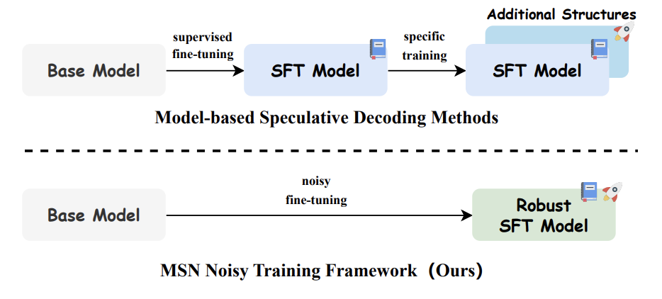
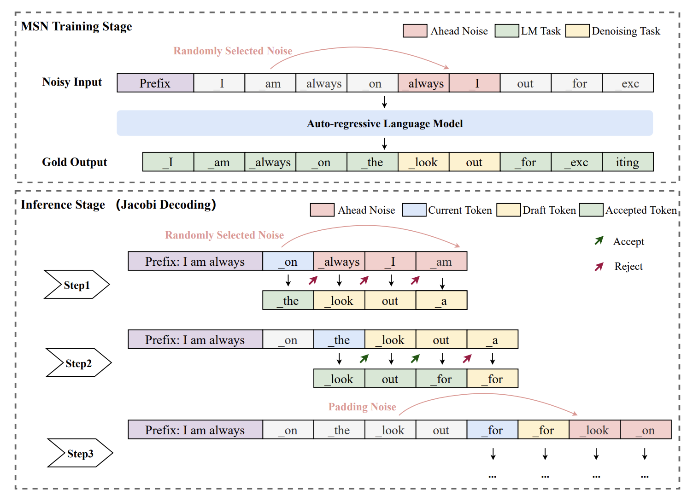
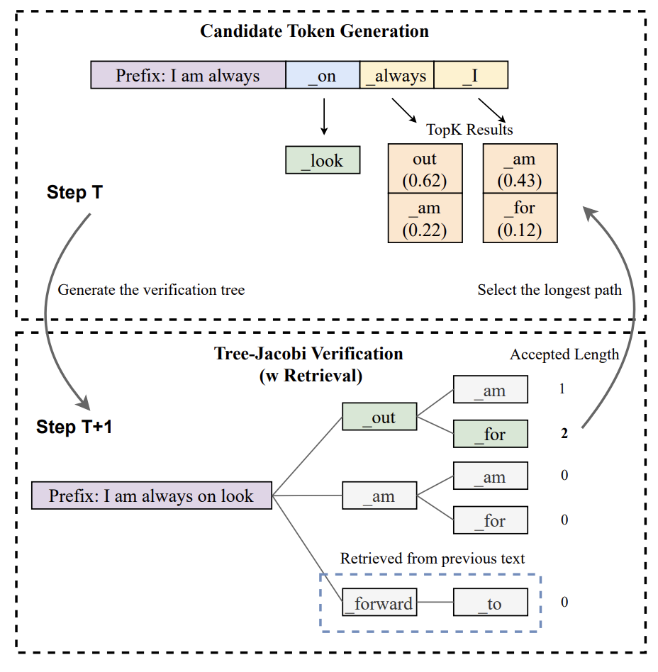

# Make Some Noise (MSN) Framework
Implementation of EMNLP 2024 paper [Make Some Noise: Unlocking Language Model Parallel Inference
Capability through Noisy Training](https://arxiv.org/pdf/2406.17404).

<div style="text-align: center">

</div>

## Requirements
- Environment: We adopt the same environment as used in [Spec-Bench](https://github.com/hemingkx/Spec-Bench) to facilitate a fair and consistent evaluation.
- Prepared Models: For convenience of testing, we release the weights of both the general-purpose model [[Llama3-8B-MSN](https://huggingface.co/DecoderImmortal/Llama3-8B-MSN)] and the code-specific model [[DeepSeek-Coder-7B-MSN](https://huggingface.co/DecoderImmortal/DeepSeek-Coder-7B-MSN)] trained on MSN as discussed in the paper.

## A minimal implementation of MSN

<div style="text-align: center">

</div>

The MSN framework can be easily integrated into the data preprocessing stage of any training script. The entire noise addition process is as follows:

```python
# L denotes the noise length hyperparameter, which is typically set to 5.
dataset = [
    {"source_ids": "Query prompt.",
    "input_ids": "Concatenation of the query and response.",
    "output_ids": "Copy of input_ids as label for LM task."}
]
for source_ids, input_ids in dataset:
    start_idx = random.randrange(len(source_ids), len(input_ids)-L)
    for mask_i in range(start_idx, start_idx+L):
        # Noise is added only to the input portion corresponding to the response.
        input_ids[mask_i] = random.choice(input_ids[:mask_i])

```

## TR-Jacobi

<div style="text-align: center">

</div>

We demonstrate how to use TR-Jacobi to accelerate the MSN-trained model in ```src/inference_msn.py```.

```python
# jacobi decoding
spec_res_ids, new_tokens, forward_steps, accpet_list = noise_forward(input_ids.cuda(), model, tokenizer, args.max_new_tokens)

print("msn output")
print(tokenizer.decode(spec_res_ids[0]))
print("#MTA")
print(new_tokens/forward_steps)
print("Accepted Length List")
print(accpet_list)

# msn output
# <|begin_of_text|><|start_header_id|>system<|end_header_id|>
# Give me some advices about how to write an academic paper?<|eot_id|><|start_header_id|>assistant<|end_header_id|>
# 1. Start by researching your topic and gathering relevant information. Make sure to take notes and organize your research in a way that makes sense.
# ...
# 8. Submit your paper. Make sure to follow any submission guidelines and make sure to submit your paper on time.<|eot_id|><|eot_id|>.

# MTA
# 2.2

# Accepted Length List
# [1, 2, 1, 1, 3, 1, 2, 2, 3, 1, 2, 2, 2, 2, 2, 1, 3, 1, 3, 1, 2, 1, 3, 2, 2, 2, 1, 2, 1, 2, 3, 2, 3, 3, 2, 2, 2, 2, 2, 2, 2, 2, 1, 5, 1, 3, 1, 5, 2, 1, 3, 2, 2, 2, 3, 2, 5, 1, 3, 2, 3, 2, 3, 2, 1, 4, 3, 1, 2, 2, 3, 6, 1, 2, 2, 2, 3, 2, 2, 3, 3, 2, 3, 2, 2, 2, 1, 2, 2, 2, 3, 3, 3, 1, 4, 2, 1, 2, 2, 2]
```

Run ```sh run_case.sh``` to obtain the execution process of a test sample.
The interface design of the entire ```noise_forward``` is kept consistent with Spec-Bench.


## Citation
If you find this work is useful for your research, please cite our paper:

```
@inproceedings{wang-etal-2024-make,
    title = "Make Some Noise: Unlocking Language Model Parallel Inference Capability through Noisy Training",
    author = "Wang, Yixuan  and
      Luo, Xianzhen  and
      Wei, Fuxuan  and
      Liu, Yijun  and
      Zhu, Qingfu  and
      Zhang, Xuanyu  and
      Yang, Qing  and
      Xu, Dongliang  and
      Che, Wanxiang",
    editor = "Al-Onaizan, Yaser  and
      Bansal, Mohit  and
      Chen, Yun-Nung",
    booktitle = "Proceedings of the 2024 Conference on Empirical Methods in Natural Language Processing",
    month = nov,
    year = "2024",
    address = "Miami, Florida, USA",
    publisher = "Association for Computational Linguistics",
    url = "https://aclanthology.org/2024.emnlp-main.718/",
    doi = "10.18653/v1/2024.emnlp-main.718",
    pages = "12914--12926",
}
```